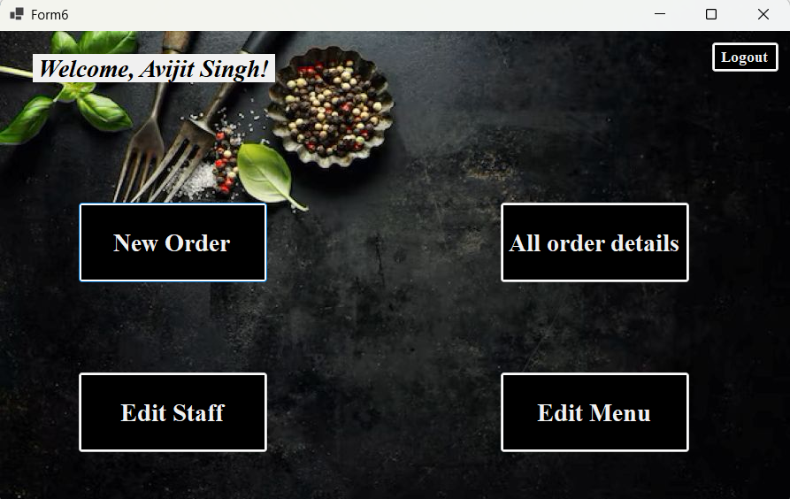
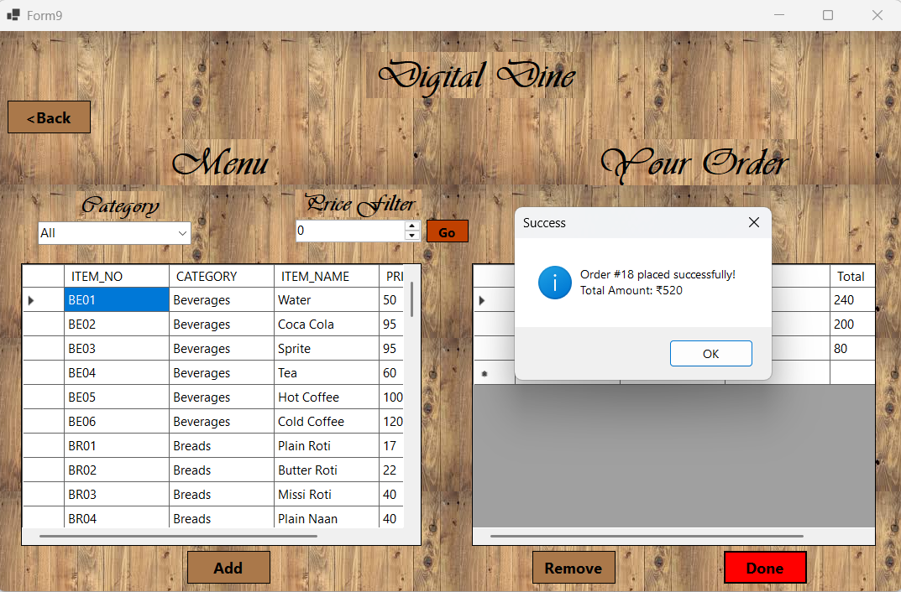

# 🍽️ Restaurant Management System (RMS)

A full-fledged **database-driven application** built using **C# (Visual Studio)** and **SQL Server (SQL Plus)**.  
This project streamlines **restaurant operations** such as order management, menu editing, staff coordination, and billing.

---

## 📌 Features
- 🔑 **Login & Role-Based Access** → Customers, Staff, and Managers.
- 🧑‍💻 **Customer Module** → Place orders, view bills, see past orders.
- 👨‍🍳 **Staff Module** → Manage orders, edit menu, generate bills.
- 📊 **Manager Module** → Edit staff details, track edits, generate reports.
- 🧾 **Billing System** → Auto-calculates tax, generates final bills.
- 📦 **Inventory & Menu Management** → Update items and categories in real-time.
- 🛠️ **Database Functions** → Triggers, procedures, normalization (2NF/BCNF).

---

## 🛠️ Tech Stack
- **Frontend:** C# (Visual Studio 2022, Windows Forms)
- **Backend:** SQL Server (SQL Plus)
- **Architecture:** Two-tier architecture (Client + Server DB)
- **Other Tools:** ER diagrams, Schema diagrams, Triggers, Normalization

---

## 📂 Project Structure
restaurant-management-system/    
|-- src/                 
|   |-- frontend/        
|   |-- backend/         
|   |-- docs/           
|-- screenshots/        
|-- Login form.sln      
|-- Login form.csproj  
|-- README.md           
|-- LICENSE             

---

## 📸 Screenshots

Here are some screenshots of the project:

### 🔑 Login Page

### 🏠 Dashboard

### 🍽️ Order Page

---

## 🧩 Database Design
- **Entities:** Customers, Staff, Orders, Menu, Bill, Order_Items, Edits
- **Normalization:** Achieved 2NF/BCNF
- **ER Diagram & Schema:** Provided in `/docs/`

---

## 📊 Queries & Triggers
- Complex SQL Queries for order processing, billing, and inventory.
- **Triggers** for logging edits.
- **Stored Functions** for order totals.

---

## 👥 Contributors
- Adarsh Agrawal
- Avijit Singh

---

## 📜 License
This project is licensed under the **MIT License** – feel free to use and modify. See [LICENSE](./LICENSE) for more information.  
